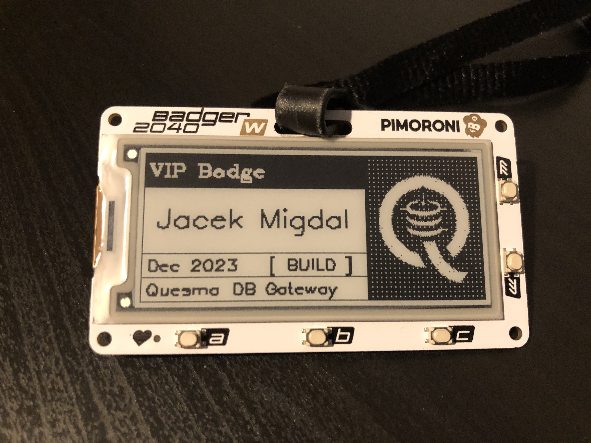

# Hardware: custom badge for conference.

I owned a nice [Badger 2040 W](https://shop.pimoroni.com/products/badger-2040-w?variant=40514062188627): Raspberry Pi Pico W with E Ink®.

It used to be a breeze to program it, but it hit many issues with [Thonny](https://thonny.org/).

I ended up spending the whole of my advent window in debugging connections. It either did not detect or hit some issues. I believed [advanced configuration](https://github.com/thonny/thonny/wiki/MicroPython#advanced-configuration) customization might helped.

Periodically remind yourself that developing software closer to hardware is slower.

Result below:

