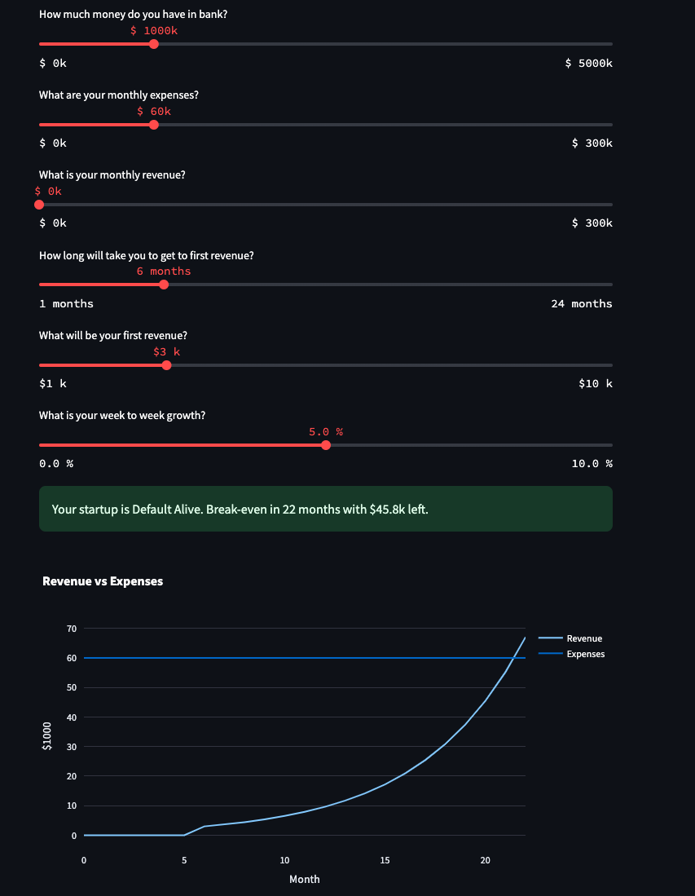

# Default alive or default dead?

One of the famous Paul Graham essays was [Default Alive or Default Dead]((http://paulgraham.com/aord.html)).

Early startups usually experience burn, a euphemism for net loss. They do that in pursuit of growth.

Knowing if a startup in its current trajectory would survive without additional external funding is good.

A [Streamlit cash forecast](https://advent-of-code-2023-day-9.streamlit.app/) for busy founders.

.
